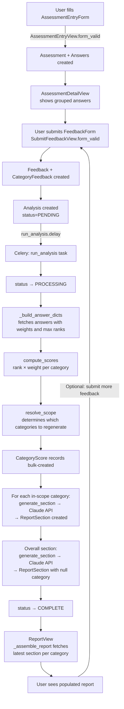

# Assessment-to-Report Flow

A completed assessment contains a set of weighted, ranked answers. The pipeline transforms those answers into a scored analysis and then into AI-written narrative report sections — one per business category plus an overall summary. Advisors can submit feedback to trigger a re-analysis that refines only the sections their feedback touches.

Three design decisions shape the whole pipeline:

- **Async analysis** — report generation is handled by a Celery task so the web request returns immediately.
- **Incremental re-generation** — `resolve_scope` determines which sections to regenerate on each re-analysis run, so only the sections touched by new feedback are rewritten.
- **Latest-section assembly** — `_assemble_report` always displays the newest `ReportSection` per category across all analysis runs, so sections from different runs can coexist in a single displayed report.

---

## High-level diagram



---

## Models

| Model | App | Key fields | Role in pipeline |
|---|---|---|---|
| `Assessment` | `assessments` | `template`, `client` | Root entity; owns all answers |
| `Answer` | `assessments` | `assessment`, `question`, `selected_option`, `question_snapshot`, `option_snapshot` | Immutable answer record; snapshots preserve question/option state at submission time |
| `Analysis` | `analysis` | `assessment`, `feedback` (nullable), `status`, `total_score` | One analysis run; `status` tracks the async job (PENDING → PROCESSING → COMPLETE/FAILED) |
| `CategoryScore` | `analysis` | `analysis`, `category`, `score`, `max_possible_score` | Per-category numeric score for one analysis run |
| `Feedback` | `reports` | `assessment`, `overall_text` | Advisor's overall notes; presence triggers full regeneration |
| `CategoryFeedback` | `reports` | `feedback`, `category`, `text` | Per-category advisor notes; triggers targeted regeneration |
| `ReportSection` | `reports` | `analysis`, `category` (nullable = overall), `content` | AI-generated prose; `category=None` is the overall summary section |

---

## Pipeline stage by stage

### Stage 1 — Capture assessment answers

[`assessments/forms.py:71`](../complete_business_analysis_tool/assessments/forms.py#L71) `AssessmentEntryForm.save()` runs in an atomic transaction. It creates the `Assessment` record and one `Answer` per question, storing `question_snapshot` (the question text) and `option_snapshot` (the full option metadata including rank and weight) so the report can be generated accurately even if the template changes later.

[`assessments/views.py:70`](../complete_business_analysis_tool/assessments/views.py#L70) `AssessmentEntryView.form_valid()` calls `form.save()` and redirects to the assessment list.

### Stage 2 — Submit feedback and queue the analysis

[`reports/forms.py:4`](../complete_business_analysis_tool/reports/forms.py#L4) `FeedbackForm` generates fields dynamically: one `overall_text` textarea plus one `category_{pk}` field per category that has answers in this assessment. The form validates that at least one field contains text.

[`reports/views.py:64`](../complete_business_analysis_tool/reports/views.py#L64) `SubmitFeedbackView.form_valid()`:
1. Creates a `Feedback` record with `overall_text`.
2. Creates a `CategoryFeedback` for each category field that has text.
3. Creates an `Analysis(status=PENDING)` linked to the `Feedback`.
4. Calls `analysis.full_clean()` — `Analysis.clean()` raises `ValidationError` if another PENDING or PROCESSING analysis already exists for this assessment, preventing duplicate concurrent runs.
5. On clean validation, saves the `Analysis` and fires `run_analysis.delay(str(analysis.pk))`.

### Stage 3 — Async analysis task

[`analysis/tasks.py:134`](../complete_business_analysis_tool/analysis/tasks.py#L134) `run_analysis()` is a Celery `@shared_task`. It sets the analysis status to PROCESSING, delegates to `_run_analysis_work()`, then sets the status to COMPLETE. Any unhandled exception sets it to FAILED.

### Stage 4 — Build answer data

[`analysis/tasks.py:12`](../complete_business_analysis_tool/analysis/tasks.py#L12) `_build_answer_dicts(assessment)` queries the assessment's answers with `select_related("selected_option__question__category")` and annotates each row with `max_rank` (the highest rank among all options for that question). Returns a list of dicts:

```
category_id, category_name, rank, weight, max_rank,
question_snapshot, option_snapshot
```

Answers without a `selected_option` or without a category are excluded.

### Stage 5 — Score computation

[`analysis/scoring.py:23`](../complete_business_analysis_tool/analysis/scoring.py#L23) `compute_scores(answer_dicts)` is a pure function with no ORM calls. For each answer:

```
score     = rank × weight
max_score = max_rank × weight
```

Scores are aggregated by category and summed into a total. Returns a `ScoreResult` dataclass with `category_scores`, `category_max_scores`, `total`, and `total_max`.

### Stage 6 — Scope resolution

[`analysis/scope.py:1`](../complete_business_analysis_tool/analysis/scope.py#L1) `resolve_scope(overall_text, category_feedback_ids, all_category_ids)` decides which categories to regenerate:

- If `overall_text` is present → regenerate **all** categories.
- Otherwise → regenerate only categories that have a matching `CategoryFeedback`.

On the very first analysis run (no feedback), the caller skips `resolve_scope` and processes all categories directly.

### Stage 7 — Persist scores

[`analysis/tasks.py:35`](../complete_business_analysis_tool/analysis/tasks.py#L35) `_run_analysis_work()` bulk-creates `CategoryScore` records for each in-scope category, then updates `analysis.total_score` with the overall sum.

### Stage 8 — Generate report sections

[`reports/ai_service.py:13`](../complete_business_analysis_tool/reports/ai_service.py#L13) `generate_section(scope_label, answers, category_scores, total_score, feedback_text, prior_content, llm_client)` builds a prompt via `_build_prompt()` ([`ai_service.py:35`](../complete_business_analysis_tool/reports/ai_service.py#L35)) and calls Claude Sonnet 4.6 (`claude-sonnet-4-6`, 1024 max tokens). The prompt includes the section label, category score table, all Q&A pairs for the scope, any prior content (for revision), and any advisor feedback. Returns the generated prose string.

`_run_analysis_work()` then:
- Iterates over in-scope categories; for each, retrieves the most recent existing `ReportSection` as `prior_content` (if one exists), calls `generate_section()`, and creates a new `ReportSection` linked to this `Analysis`.
- Always generates the overall section last (null category), using all answers and all category scores.

### Stage 9 — Assemble report for display

[`reports/views.py:96`](../complete_business_analysis_tool/reports/views.py#L96) `_assemble_report(assessment)` uses a subquery to fetch the most recent `ReportSection` per `category_id` across all analysis runs for the assessment. It returns the overall section first, then category sections ordered by name.

[`reports/views.py:18`](../complete_business_analysis_tool/reports/views.py#L18) `ReportView` passes `sections`, `feedback_form`, and `category_fields` to the template so users can read the report and submit additional feedback in the same view.

---

## Re-analysis and the feedback loop

Submitting the `FeedbackForm` a second time creates a new `Feedback` and a new `Analysis` — the previous analysis records are preserved. `resolve_scope` narrows which categories are regenerated based on what feedback was provided. Because `_assemble_report` always shows the newest `ReportSection` per category, a re-analysis that only touches two categories will display the new sections for those two and the older sections for everything else. This means sections from different analysis runs can coexist in one displayed report.
